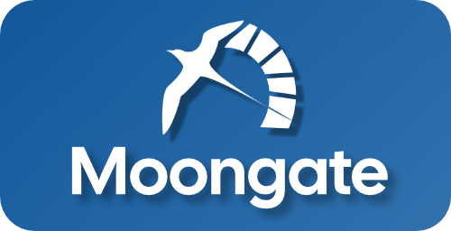
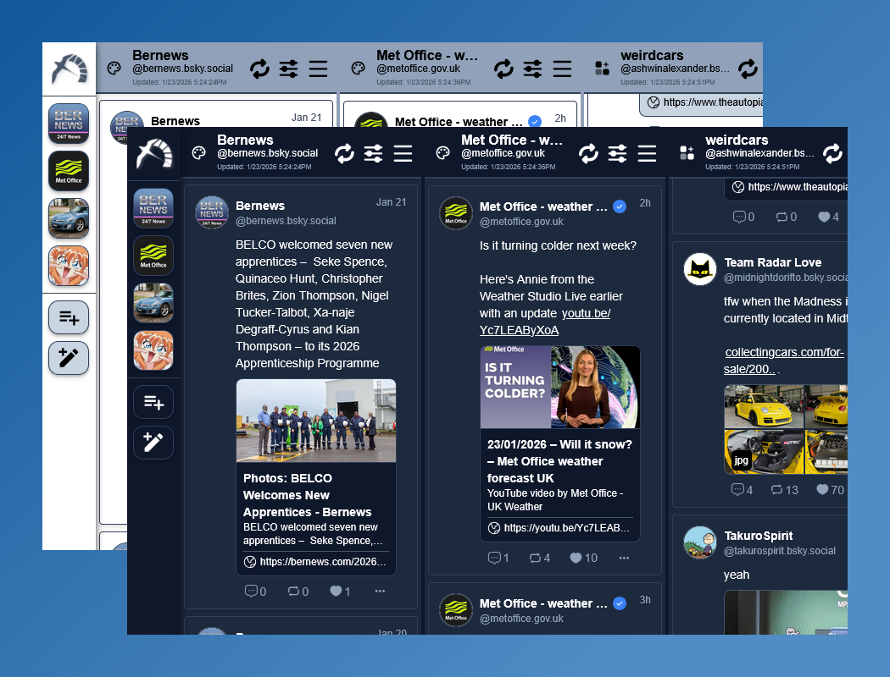
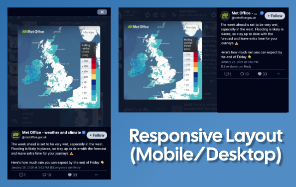
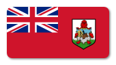

<div align="center">
    <a></a>
</div>
<h1>Moongate</h1><!--Add badges via shields.io-->
<p>
Moongate is a Desktop/Web Client App for Bluesky, built using Tauri + Vue. The goal is to create a lightweight, feature-filled app that is responsive and easy to use.
</p>


## Features
<div align="center">
    <a href="https://fourfour.one/moon"></a>
</div>

**Moongate** currently offers the following features:

- Multi-column Feed layout
- Ability to browse Bluesky content without account
- Media tab for accounts with grid layout :framed_picture:
- Ability to save images with author details :memo:
- Light and Dark themes :sunrise: :city_sunset:
- Responsive layout that supports mobile screens:

<div align="center">

</div>

## Coming Soon
- OAuth Login and session management. :handshake:
- Manage multiple accounts at once. :juggling_person:
- Save media content with Post and User metadata for future ease of attribution. :artist:
- Mobile + other OS versions. :iphone:

## How to Build
If you would like to build the application on your system, clone the repository, navigate to the folder and then perform these actions:
```bash
#install dependancies
npm install
#run web app in dev mode
npm run dev
#or run tauri desktop version
npm run tauri dev
```

## Contributing
Pull requests are welcome. For major changes, please open an issue first
to discuss what you would like to change.

Please make sure to update tests as appropriate.

## Support
If you come across any issues, you can report them [here](https://github.com/sondaismith/moongate/issues).

## License
moongate is released under the [MIT license](./LICENSE.md).

## ...
<details>
<summary>Why moongate?</summary>
<p>
The association with good luck +
     representation + it's sort of related to the sky?
</p>
</details>